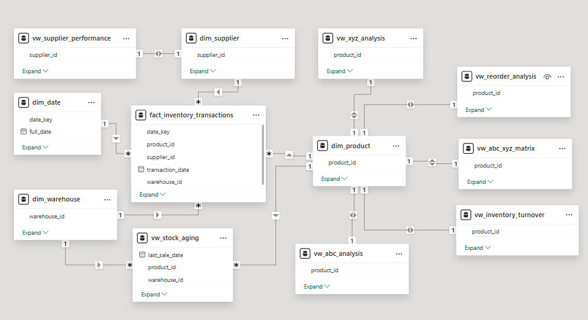

# 📦 RetailMart BD — Inventory Optimization & Dead Stock Detection

An end-to-end data analytics project that identifies dead stock, segments inventory by revenue and demand volatility, and builds a proactive reorder system for a simulated FMCG retail company in Bangladesh.

🏢 **Domain:** Retail / FMCG Supply Chain

🛠️ **Tools:** Excel · SQL Server (SSMS) · Power BI

📊 **Dataset:** Simulated realistic data

---

## 🧩 The Problem

> 💬 *"Our warehouses are full, but we're out of cash. And customers still complain we're out of stock."*

🏪 RetailMart BD — a mid-sized FMCG retailer running 3 warehouses and 35 SKUs — had no data-backed system to answer three basic questions:

* 📉 Which products have been sitting in the warehouse for months, blocking working capital?
* 📈 Which products are in high demand but frequently running out of stock?
* ⏰ When is the right time to reorder, and what is the optimal order quantity?
* 🚚 Which suppliers have the longest delays, and how is that contributing to stockouts?

Consequently, the company is suffering from two contradictory issues at the same time: **Overstocking** and **Stockouts**. Having both problems simultaneously indicates severe inefficiencies across three major departments:

1. 🛒 **Procurement** (Purchasing & Vendor Management)
2. 🏬 **Warehousing** (Inventory & Storage Management)
3. 💼 **Sales** (Demand Forecasting & Market Alignment)

---

## 🔍 What I Found

| Metric | Value |
|---|---|
| Total Inventory Value | ৳60.85L |
| Dead Stock Value | ৳75,980 (1.25%) |
| Products Classified as Dead Stock (CZ segment) | 5 of 35 |
| Average Idle Days (dead stock) | 538 days |
| Dead Stock Traced to Import Suppliers | **100%** |
| Current Stockout Risk | 0 products |
| Company-wide Inventory Turnover | ~1.3 (healthy benchmark: 4–8) |

**The headline insight:** RetailMart BD doesn't have a stockout problem — it has a **selective overstocking problem**, concentrated almost entirely around two long-lead-time import suppliers and a handful of niche, low-demand products.

📄 **[Read the full Insight Report →](./INSIGHT_REPORT.md)**

---

## 🏗️ Project Architecture

The project follows a Star Schema design — one fact table surrounded by four dimension tables — built specifically for clean, fast Power BI reporting.

```
                dim_date
                    │
dim_warehouse ──┐   │   ┌── dim_product
                 │   │   │
            fact_inventory_transactions
                     │
                dim_supplier
```
### 🏗️ Data Model
Here is the data model schema used for this project:



---

| Table | Role |
|---|---|
| `fact_inventory_transactions` | Every Sale, Purchase, Return, and Adjustment — the core of the model |
| `dim_product` | 35 SKUs across 5 categories, with cost, price, and reorder thresholds |
| `dim_supplier` | 10 suppliers (8 local, 2 import) with lead time and reliability score |
| `dim_warehouse` | 3 warehouses across Dhaka, Chittagong, and Sylhet |
| `dim_date` | A full calendar table (Jan 2023 – Dec 2024) for time intelligence |

On top of this schema sit **7 analytical SQL views** that power the dashboard 
1. ABC analysis
2. XYZ (demand volatility) analysis
3. A combined ABC-XYZ matrix
4. Stock Aging
5. Reorder Point Calculation
6. Inventory Turnover
7. Supplier Performance.

The dashboard itself adds another layer of logic on top — 20+ DAX measures handling everything from conditional aggregation to BLANK-vs-zero edge cases. Full reference: [`DAX_MEASURES`](./03_powerbi/DAX_MEASURES.md).

---

## ⚙️ The Process

### 1. Data Cleaning (Excel)
Started with an intentionally messy raw dataset — mixed date formats, inconsistent transaction-type spelling, missing supplier IDs, wrong-sign quantities, and duplicate rows. Cleaned using formulas (`VLOOKUP`, `TRIM`, `SUBSTITUTE`, custom date-parsing) rather than manual edits, so the process is traceable and repeatable.

### 2. Data Modeling (SQL Server)
Loaded the cleaned data into a Star Schema, then recalculated `stock_balance` from scratch using window functions (`SUM() OVER (PARTITION BY ... ORDER BY ...)`), since the raw balance column was just a placeholder.

### 3. Analysis (SQL Server)
Built 7 views covering inventory segmentation, aging, reorder logic, turnover, and supplier risk — all designed to exclude flagged data-quality rows automatically.

### 4. Visualization (Power BI)
A 5-page interactive dashboard connecting directly to the SQL views, with DAX measures, conditional formatting, and cross-filtering across all pages.

---

## 🐛 Data Quality — What Actually Went Wrong (and How I Fixed It)

This project hit several real data-quality problems along the way. Rather than deleting anything, every issue was root-caused and **flagged**, not removed — preserving a full audit trail.

| Issue | What Happened | How It Was Fixed |
|---|---|---|
| Mixed date formats | `D/M/YYYY`, `M-D-YYYY`, and `YYYY-MM-DD` mixed in the same column | Manual string parsing (`LEFT`/`MID`/`RIGHT` + `DATE()`), since `DATEVALUE()` couldn't reliably auto-detect the format |
| Quantity sign errors | A bulk fix accidentally made *all* quantities positive, breaking the running stock balance | Re-applied sign correction by transaction type, then recalculated `stock_balance` |
| Missing values silently became `0` | NULL quantities were converted to `0` during load, which is *not* the same as "no data" | Flagged all `quantity = 0` rows via `data_issue = 1`, excluded from analysis |
| XYZ analysis showed dead-stock products as "stable" | Coefficient of Variation was calculated only over months *with* sales, ignoring the 17 months with zero sales | Rebuilt the calculation over a complete 24-month grid (missing months = 0, not excluded) |
| Reorder Point flagged a dead product as "Reorder Now" | Average daily sales was calculated only over active-selling days, inflating the average | Recalculated over the full 730-day period |
| 1,447 transactions showed impossible negative stock balances | Purchases were allocated randomly across warehouses while sales followed a fixed per-warehouse demand share, causing some warehouses to "sell" stock they never received | Rebuilt the data-generation logic to track running stock per warehouse — reduced the issue to 40 explainable edge cases (~0.4%), which were flagged rather than forced to zero |

*(Full detail on each of these is in the [Insight Report](./INSIGHT_REPORT.md), Section 7.)*

---

## 📊 Dashboard Preview

| Page | Focus |
|---|---|
| **Executive Overview** | KPI summary, stock aging distribution, revenue by category, dead stock by supplier country |
| **ABC-XYZ Segmentation** | 9-segment heatmap matrix, segment-wise revenue, product-level drill-down |
| **Dead & Slow Stock Report** | Aging analysis, financial impact by category, top dead-stock items |
| **Reorder Alert Panel** | Reorder status by product, supplier lead-time comparison |
| **Trend Analysis** | Monthly sales vs. purchase trend, seasonal patterns, turnover by category |

📸 See [`/04_screenshots`](./04_screenshots) for full-page captures of each dashboard view.

---

## 📁 Repository Structure

```
retailmart-bd-inventory-optimization/
├── README.md
├── INSIGHT_REPORT_EN.md
├── 01_excel/              → Raw and cleaned source data
├── 02_sql/                → Schema, data load, quality fixes, analysis views
├── 03_powerbi/            → Power BI .pbix file
└── 04_screenshots/        → Dashboard page captures
```

---

## 🔁 How to Reproduce This

1. Open `01_excel/` and review the raw → cleaned transformation
2. Run the SQL scripts in `02_sql/` **in order** (01 → 02 → 03 → 04) against a SQL Server instance
3. Open `03_powerbi/RetailMart_BD_Dashboard.pbix` in Power BI Desktop and point the data source to your local SQL Server instance
4. Refresh — the dashboard will rebuild from the views

---

## 🧠 Key Takeaways From Building This

- **A single technique is rarely enough.** ABC analysis alone couldn't separate "low-revenue but stable" products from genuinely dead stock — it took XYZ (volatility) analysis layered on top to find the real signal.
- **Missing data and zero are not the same thing**, and conflating them quietly breaks averages, variability calculations, and reorder logic in ways that don't throw errors — they just produce confident-looking wrong answers.
- **Flag, don't delete.** Every data quality issue in this project was kept in the dataset and explicitly excluded via a flag, rather than removed — which made the analysis auditable and the report's "Limitations" section honest rather than hand-wavy.

---

**Built by Suborno** as part of a self-directed data analyst portfolio.
