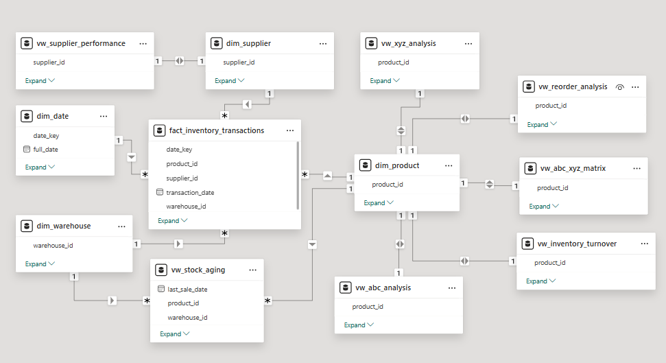
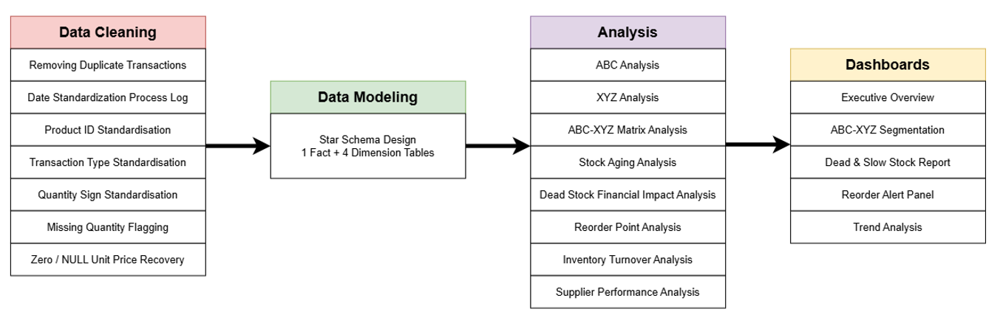

# 📦 RetailMart BD — Inventory Optimization & Dead Stock Detection

An end-to-end data analytics project that identifies dead stock, segments inventory by revenue and demand volatility, and builds a proactive reorder system for a simulated FMCG retail company in Bangladesh.

🏢 **Domain:** Retail / FMCG Supply Chain

🛠️ **Tools:** Excel · SQL Server (SSMS) · Power BI

📊 **Dataset:** Simulated realistic data

---

## 🧩 The Problem

> 💬 *"Our warehouses are full, but we're out of cash. And customers still complain we're out of stock."*

RetailMart BD — a mid-sized FMCG retailer operating 3 warehouses and managing 35 SKUs — had no data-backed system to answer three basic questions:

- 📦 Which products have been sitting in the warehouse for months, silently blocking working capital?
- ⚠️ Which products are in high demand but at risk of stocking out?
- 🔄 When is the right time to reorder, and how much should be ordered?

Without answers, the company was caught between two contradictory problems at the same time — **overstocking and stockouts** — pointing to inefficiencies across Procurement, Warehousing, and Sales simultaneously.

---

## 🔍 What I Found

| Metric | Value |
|---|---|
| Total Inventory Value | ৳60.85L |
| Dead Stock Value | ৳75,980 (1.25%) |
| Dead Stock Products (CZ Segment) | 5 of 35 SKUs |
| Average Idle Days (Dead Stock) | 538 days |
| Dead Stock Traced to Import Suppliers | **100%** |
| Current Stockout Risk | 0 products |
| Company-wide Inventory Turnover | ~1.3x (healthy benchmark: 4–8x) |

**The headline insight:** RetailMart BD doesn't have a stockout problem — it has a **selective overstocking problem**, concentrated almost entirely around two long-lead-time import suppliers and a handful of niche, low-demand products.

📄 **[Insight Report →](./04_INSIGHT_REPORT.md)**
📁 **[Full Project Documentation →](./01_PROJECT_DOCUMENTATION.md)**

---

## 📁 Repository Structure

```
retailmart-bd-inventory-optimization/
├── 📁 01_datasets/
│   └── 📁 cleaned_data/
├── 📁 02_sql/
├── 📁 03_powerbi/
│   └── 📁 dashboard_snapshots/
├── 📁 04_necessary_image/
├── 📄 01_PROJECT_DOCUMENTATION.md
├── 📄 02_ANALYSIS_FINDINGS.md
├── 📄 03_DASHBOARD_INSIGHTS.md
├── 📄 04_INSIGHT_REPORT.md
├── 📄 LICENSE
└── 📄 README.md
```

---

## 🏗️ Project Architecture

The project follows a **Star Schema** — one central fact table surrounded by four dimension tables — designed for clean, efficient Power BI reporting.

```
                dim_date
                    │
dim_warehouse ──┐   │   ┌── dim_product
                │   │   │
           fact_inventory_transactions
                    │
               dim_supplier
```

### 🗂️ Data Model



| Table | Role |
|---|---|
| `fact_inventory_transactions` | Every Sale, Purchase, Return, and Adjustment — the core of the model |
| `dim_product` | 35 SKUs across 5 categories, with cost, price, and reorder thresholds |
| `dim_supplier` | 10 suppliers (8 local, 2 import) with lead time and reliability score |
| `dim_warehouse` | 3 warehouses across Dhaka, Chittagong, and Sylhet |
| `dim_date` | Full calendar table (Jan 2023 – Dec 2024) for time intelligence |

On top of this schema sit **7 analytical SQL views** that power the dashboard:

1. ABC Analysis
2. XYZ (Demand Volatility) Analysis
3. ABC-XYZ Combined Matrix
4. Stock Aging Analysis
5. Reorder Point Calculation
6. Inventory Turnover Analysis
7. Supplier Performance Analysis

The dashboard adds a further layer of logic — 20+ DAX measures handling conditional aggregation, BLANK-vs-zero edge cases, and dynamic threshold formatting. Full reference: [`DAX_MEASURES.md`](./03_powerbi/DAX_MEASURES.md)

---

## ⚙️ The Process

<p align="center">
  
</p>

📊 Full analysis findings → [`02_ANALYSIS_FINDINGS.md`](./02_ANALYSIS_FINDINGS.md)

---

## 📊 Dashboard Preview

| Page | Focus |
|---|---|
| 🗂️ **Executive Overview** | KPI summary, stock aging distribution, revenue by category, dead stock by supplier country |
| 🎯 **ABC-XYZ Segmentation** | 9-segment heatmap matrix, segment-wise revenue, product-level drill-down |
| 🔴 **Dead & Slow Stock Report** | Aging analysis, financial impact by category, top dead-stock items by idle days |
| 🟢 **Reorder Alert Panel** | Reorder status by product, supplier lead-time comparison |
| 📈 **Trend Analysis** | Monthly sales vs. purchase trend, seasonal patterns, turnover by category |

📸 Dashboard snapshots → [`/dashboard_snapshots`](./03_powerbi/dashboard_snapshots)
📈 Page-by-page insights → [`03_DASHBOARD_INSIGHTS.md`](./03_DASHBOARD_INSIGHTS.md)

---

## 🔁 How to Reproduce This

1. Open `01_datasets/` and review the raw → cleaned data transformation
2. Run the SQL scripts in `02_sql/` **in order** (01 → 02 → 03 → 04) against a SQL Server instance
3. Open `03_powerbi/RetailMart_BD_Dashboard.pbix` in Power BI Desktop and connect to your local SQL Server instance
4. Refresh — the dashboard rebuilds from the views automatically

📁 Full technical documentation → [`01_PROJECT_DOCUMENTATION.md`](./01_PROJECT_DOCUMENTATION.md)

---

**Built by Suborno** as part of a self-directed data analyst portfolio.
